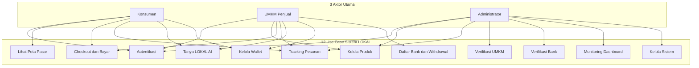
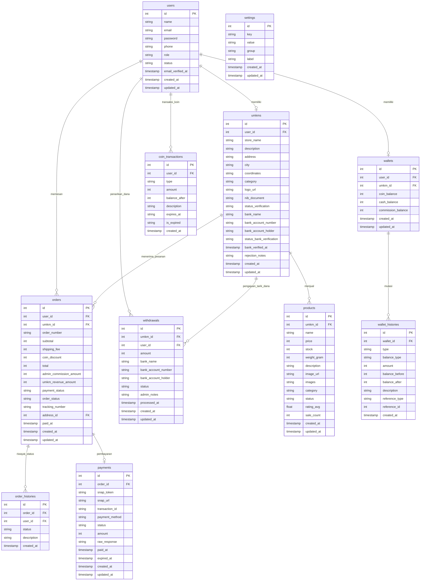
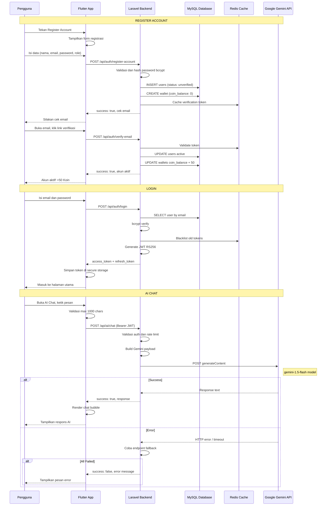
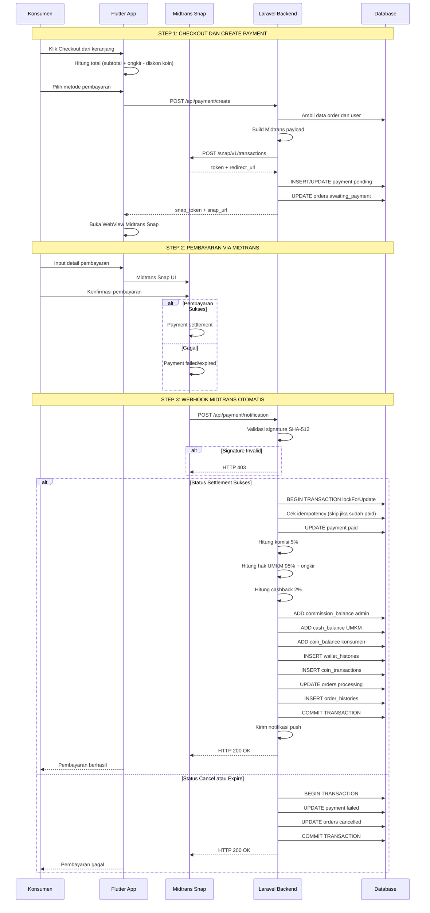
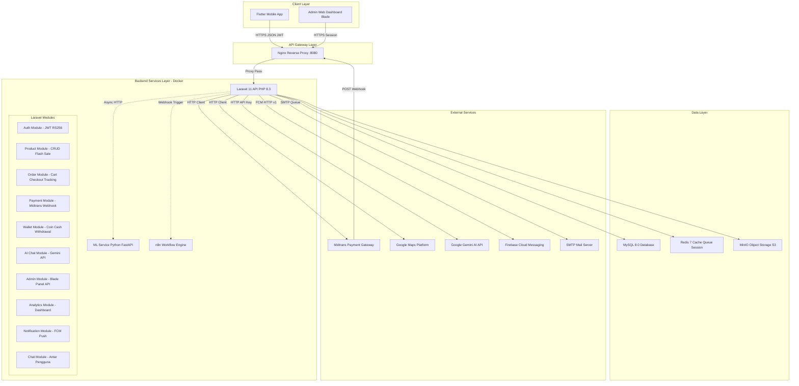
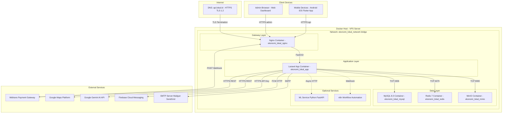

# Dokumentasi Teknis Platform LOKAL v1.5.0

**Diagram Arsitektur & Desain Sistem**

*Platform Digital Berbasis Mobile untuk Optimalisasi Sirkulasi Ekonomi Lokal*

| Dokumen            | Detail                                                  |
|--------------------|---------------------------------------------------------|
| **Versi**          | 1.5.0 - Juli 2026                                      |
| **Aplikasi**       | LOKAL (EkonomiLokal)                                    |
| **Teknologi**      | Flutter 3.x + Laravel 11 + MySQL 8.0 + Docker           |
| **Tim Pengembang** | Tim Pengembang Platform LOKAL - UKRI                    |

---

## Daftar Isi

1. [Use Case Diagram & Skenario](#1-use-case-diagram--skenario)
2. [Entity Relationship Diagram (ERD)](#2-entity-relationship-diagram-erd)
3. [Class Diagram (Domain Business Structure)](#3-class-diagram-domain-business-structure)
4. [Sequence Diagram](#4-sequence-diagram)
5. [Component Diagram](#5-component-diagram)
6. [Deployment Diagram (Topologi Docker)](#6-deployment-diagram-topologi-infrastruktur--container-docker)

---

## 1. Use Case Diagram & Skenario

Diagram ini menggambarkan interaksi **3 aktor utama** (Konsumen, UMKM, Admin) dengan sistem LOKAL beserta use case yang tersedia.



### Tabel Skenario Use Case Utama

| Kode | Use Case | Aktor | Deskripsi Singkat | Prioritas |
|------|----------|-------|-------------------|:---------:|
| UC-01 | Autentikasi | Konsumen, UMKM, Admin | Register Account, login Email+Password, JWT RS256, reset password, verifikasi email | **Tinggi** |
| UC-02 | Lihat Peta Pasar | Konsumen | Peta interaktif Google Maps, filter radius 0.5-10 km, marker UMKM, info window | **Tinggi** |
| UC-03 | Kelola Produk | UMKM, Admin | CRUD produk, upload foto (max 5), atur harga and stok, approve produk | **Tinggi** |
| UC-04 | Checkout and Bayar | Konsumen, UMKM | Keranjang multi-UMKM, checkout Midtrans (GoPay/OVO/DANA/VA/QRIS), konfirmasi otomatis via webhook | **Tinggi** |
| UC-05 | Tracking Pesanan | Konsumen, UMKM, Admin | Timeline status real-time, input nomor resi (UMKM), view tracking (Konsumen) | **Tinggi** |
| UC-06 | Tanya LOKAL AI | Konsumen, UMKM | Chatbot Gemini API, Bahasa Indonesia kasual, bantuan produk and bisnis | **Sedang** |
| UC-07 | Kelola Wallet | Konsumen, UMKM | Lihat saldo koin and tunai, redeem koin (diskon max 20%), riwayat transaksi | **Sedang** |
| UC-08 | Daftar Bank and Withdrawal | UMKM | Daftar rekening bank (pending), verifikasi Admin (approved/rejected), tarik dana (min Rp50.000) | **Tinggi** |
| UC-09 | Verifikasi UMKM | Admin | Approve/reject pendaftaran UMKM setelah cek NIB/SIUP | **Tinggi** |
| UC-10 | Verifikasi Bank | Admin | Approve/reject rekening bank UMKM sebelum withdrawal | **Tinggi** |
| UC-11 | Dashboard Finansial | Admin | Grafik pendapatan platform, total user/UMKM/order, komisi, analitik | **Tinggi** |
| UC-12 | Kelola Sistem | Admin | Pengaturan global (komisi 5%, cashback 2%, diskon koin 20%), broadcast notifikasi | **Sedang** |

---

## 2. Entity Relationship Diagram (ERD)

Diagram berikut menggambarkan hubungan antar tabel database inti platform LOKAL.



### Tabel Relasi Antar Entitas

| Entitas #1 | Relasi | Entitas #2 | Makna Bisnis |
|------------|:------:|------------|--------------|
| `users` | 1 ke 1 | `umkms` | Satu user dapat memiliki satu toko UMKM |
| `users` | 1 ke N | `orders` | Konsumen dapat memesan banyak order |
| `users` | 1 ke 1 | `wallets` | Setiap user memiliki satu dompet |
| `users` | 1 ke N | `coin_transactions` | Riwayat transaksi koin per user |
| `users` | 1 ke N | `withdrawals` | Riwayat penarikan dana (UMKM) |
| `umkms` | 1 ke N | `products` | UMKM memiliki banyak produk |
| `umkms` | 1 ke N | `orders` | UMKM menerima banyak pesanan masuk |
| `umkms` | 1 ke N | `withdrawals` | UMKM dapat mengajukan banyak penarikan dana |
| `orders` | 1 ke N | `order_histories` | Satu order memiliki banyak riwayat perubahan status |
| `orders` | 1 ke 1 | `payments` | Satu order memiliki satu record pembayaran |
| `wallets` | 1 ke N | `wallet_histories` | Satu dompet memiliki banyak mutasi |
| `settings` | - | - | Tabel konfigurasi global (komisi 5%, cashback 2%, diskon koin 20%) |

---

## 3. Class Diagram (Domain Business Structure)

Diagram class berikut merepresentasikan struktur objek bisnis inti, hubungan antar entitas, atribut utama, dan method/fungsi kunci.

```mermaid
classDiagram
    class User {
        +int id
        +string name
        +string email
        +string password
        +string phone
        +string role
        +string status
        +timestamp email_verified_at
        +timestamp created_at
        +timestamp updated_at
        +register() bool
        +login() string
        +verifyEmail() bool
        +resetPassword() bool
    }

    class Umkm {
        +int id
        +int user_id
        +string store_name
        +text description
        +string address
        +string city
        +string coordinates
        +string category
        +string logo_url
        +string nib_document
        +string status_verification
        +string bank_name
        +string bank_account_number
        +string bank_account_holder
        +string status_bank_verification
        +timestamp bank_verified_at
        +text rejection_notes
        +getProducts()
        +getOrders()
        +getAnalytics()
    }

    class Product {
        +int id
        +int umkm_id
        +string name
        +int price
        +int stock
        +int weight_gram
        +text description
        +string image_url
        +string images
        +string category
        +string status
        +float rating_avg
        +int sale_count
        +timestamp created_at
        +timestamp updated_at
        +updateStock(int qty)
        +isAvailable()
    }

    class Order {
        +int id
        +int user_id
        +int umkm_id
        +string order_number
        +int subtotal
        +int shipping_fee
        +int coin_discount
        +int total
        +int admin_commission_amount
        +int umkm_revenue_amount
        +string payment_status
        +string order_status
        +string tracking_number
        +int address_id
        +timestamp paid_at
        +timestamp created_at
        +timestamp updated_at
        +cancel()
        +confirmReceived()
        +getTrackingHistory()
    }

    class OrderHistory {
        +int id
        +int order_id
        +int user_id
        +string status
        +string description
        +timestamp created_at
    }

    class Payment {
        +int id
        +int order_id
        +string snap_token
        +string snap_url
        +string transaction_id
        +string payment_method
        +string status
        +int amount
        +text raw_response
        +timestamp paid_at
        +timestamp expired_at
        +timestamp created_at
        +timestamp updated_at
    }

    class Wallet {
        +int id
        +int user_id
        +int umkm_id
        +int coin_balance
        +int cash_balance
        +int commission_balance
        +timestamp created_at
        +timestamp updated_at
        +recordHistory()
        +getBalance()
    }

    class WalletHistory {
        +int id
        +int wallet_id
        +string type
        +string balance_type
        +int amount
        +int balance_before
        +int balance_after
        +string description
        +string reference_type
        +int reference_id
        +timestamp created_at
    }

    class CoinTransaction {
        +int id
        +int user_id
        +string type
        +int amount
        +int balance_after
        +string description
        +date expires_at
        +boolean is_expired
        +timestamp created_at
    }

    class Withdrawal {
        +int id
        +int umkm_id
        +int user_id
        +int amount
        +string bank_name
        +string bank_account_number
        +string bank_account_holder
        +string status
        +text admin_notes
        +timestamp processed_at
        +timestamp created_at
        +timestamp updated_at
    }

    class Setting {
        +int id
        +string key
        +string value
        +string group
        +string label
        +timestamp created_at
        +timestamp updated_at
        +getValue()
        +commissionPercent()
        +cashbackPercent()
        +maxCoinDiscountPercent()
        +clearCache()
    }

    class AuthController {
        +register(Request) JsonResponse
        +login(Request) JsonResponse
        +logout(Request) JsonResponse
        +me() JsonResponse
        +refresh(Request) JsonResponse
        +forgotPassword(Request) JsonResponse
        +resetPassword(Request) JsonResponse
        +verifyEmail(Request) JsonResponse
    }

    class PaymentController {
        +create(Request) JsonResponse
        +status(orderId) JsonResponse
        +notification(Request) Response
        +paymentFinish(Request) HtmlResponse
        +getTracking(id) JsonResponse
    }

    class OrderController {
        +index(Request) JsonResponse
        +store(Request) JsonResponse
        +show(id) JsonResponse
        +cancel(id) JsonResponse
        +confirmReceived(id) JsonResponse
        +sellerOrders(Request) JsonResponse
        +updateStatus(Request, id) JsonResponse
        +processPaymentWebhook(Request) JsonResponse
        +distributePaymentFunds(Order) void
    }

    class AiChatController {
        +chat(Request) JsonResponse
    }

    class WalletController {
        +index(Request) JsonResponse
        +transactions(Request) JsonResponse
        +redeem(Request) JsonResponse
        +withdraw(Request) JsonResponse
    }

    class AdminController {
        +dashboard() JsonResponse
        +users() JsonResponse
        +toggleUserStatus(Request, id) JsonResponse
        +umkmList() JsonResponse
        +verifyUmkm(Request, id) JsonResponse
        +orders() JsonResponse
        +transactions() JsonResponse
        +approveProduct(Request, id) JsonResponse
        +deleteProduct(id) JsonResponse
    }

    class CoinService {
        +int COIN_TO_RUPIAH
        +maxDiscountPercent()
        +add(userId, amount, description)
        +deduct(userId, rupiahAmount, description)
        +calculateDiscount(coinBalance, subtotal)
        +removeExpired()
    }

    class NotificationService {
        +sendToUser(userId, data)
        +sendToUmkm(umkmId, data)
        +broadcast(data)
        +registerDevice(Request)
    }

    User "1" --> "0..*" Umkm : has
    User "1" --> "0..*" Order : places
    User "1" --> "1" Wallet : has
    User "1" --> "0..*" CoinTransaction : transactions
    User "1" --> "0..*" Withdrawal : requests

    Umkm "1" --> "0..*" Product : sells
    Umkm "1" --> "0..*" Order : receives
    Umkm "1" --> "0..*" Withdrawal : withdraws
    Umkm "1" --> "1" Wallet : hasStoreWallet

    Order "1" --> "0..*" OrderHistory : hasHistory
    Order "1" --> "1" Payment : hasPayment

    Wallet "1" --> "0..*" WalletHistory : hasHistories

    PaymentController --> OrderController : delegates payment funds
    PaymentController --> NotificationService : sends notifications
    OrderController --> CoinService : processes coin rewards
    OrderController --> NotificationService : sends order notifications
```



### Tabel Fungsi Kunci

| Method | Class | Deskripsi |
|--------|-------|-----------|
| `distributePaymentFunds()` | OrderController | Distribusi dana setelah settlement: komisi 5%, alokasi 95%+ongkir ke UMKM, cashback 2% koin |
| `notification()` | PaymentController | Webhook Midtrans: validasi SHA-512, update status, distribusi dana, idempotency |
| `chat()` | AiChatController | Kirim prompt ke Gemini API, multi-endpoint fallback, parse respons |
| `add()` / `deduct()` | CoinService | Tambah/kurang koin dengan atomic DB transaction |
| `calculateDiscount()` | CoinService | Hitung maksimal diskon koin (min dari 20% subtotal atau saldo koin x 10) |
| `cancel()` | OrderController | Batalkan order: refund koin, restore stok, catat history |
| `recordHistory()` | Wallet | Catat mutasi wallet dengan balance tracking |
| `verifyUmkm()` | AdminController | Verifikasi UMKM oleh Admin (approve/reject) |

---

## 4. Sequence Diagram

### 4a. Sequence Diagram: Autentikasi & Chat AI



### 4b. Sequence Diagram: Transaksi, Webhook Midtrans & Distribusi Dana



### Detail Distribusi Dana (Settlement)

```
Order:
  subtotal        = Rp 100.000
  shipping_fee    = Rp 15.000
  coin_discount   = Rp    5.000 (digunakan diskon koin)
  total           = Rp 110.000 (100.000 + 15.000 - 5.000)

DISTRIBUSI DANA:
1. KOMISI PLATFORM (5% x subtotal)
   5% x 100.000 = Rp 5.000
   -> admin_wallet.commission_balance += 5.000

2. HAK UMKM (95% x subtotal + ongkir)
   95% x 100.000 = Rp 95.000
   + ongkir       = Rp 15.000
   -> umkm_wallet.cash_balance += Rp 110.000

3. CASHBACK KOIN (2% x total bayar)
   2% x 110.000 = Rp 2.200
   1 koin = Rp 10
   -> 220 koin ke konsumen.wallet.coin_balance
   -> expires dalam 6 bulan
```

---

## 5. Component Diagram

Diagram berikut menggambarkan pemisahan komponen sistem LOKAL secara arsitektural.



### Tabel Deskripsi Komponen

| Komponen | Teknologi | Fungsi Utama |
|----------|-----------|-------------|
| Flutter Mobile App | Flutter 3.x + Provider + Riverpod | Aplikasi mobile konsumen and UMKM (Android/iOS) |
| Admin Web Dashboard | Laravel Blade + Bootstrap | Panel admin berbasis web untuk manajemen and verifikasi |
| Nginx | Nginx Alpine | Reverse proxy, SSL termination, rate limiting, serve static |
| Laravel API | PHP 8.3 / Laravel 11 | REST API utama: auth, produk, order, payment, wallet, AI, admin |
| Auth Module | tymon/jwt-auth (RS256) | Registrasi, login, RBAC (Konsumen/UMKM/Admin) |
| Product Module | Laravel Eloquent | CRUD produk, flash sale, search, filter, kategorisasi |
| Order Module | Laravel Eloquent | Keranjang, checkout, tracking, order histories |
| Payment Module | Midtrans Snap API + Webhook | Pembayaran digital, webhook SHA-512, distribusi dana otomatis |
| Wallet Module | Laravel Service | Manajemen koin and saldo tunai, withdrawal, coin transaction |
| AI Chat Module | Google Gemini API | Chatbot AI untuk membantu konsumen and UMKM |
| Admin Module | Laravel Controller | Verifikasi UMKM and bank, dashboard finansial, pengaturan sistem |
| ML Service | Python FastAPI + scikit-learn | Rekomendasi harga produk UMKM secara asinkron |
| n8n | n8n Workflow Engine | Otomatisasi notifikasi and workflow event-driven |
| MySQL | MySQL 8.0 | Database utama dengan spatial index POINT |
| Redis | Redis 7 Alpine | Cache query, queue job, session, JWT blacklist |
| MinIO | MinIO S3-compatible | Object storage untuk foto produk and dokumen legalitas |
| Midtrans | Midtrans Snap | Payment gateway (GoPay/OVO/DANA/VA/QRIS) + webhook |
| Google Maps | Google Maps Platform | Peta interaktif, geocoding, distance matrix |
| Google Gemini | Gemini 1.5 Flash | AI generatif untuk LOKAL AI Assistant |
| FCM | Firebase Cloud Messaging | Push notification ke perangkat mobile |
| SMTP | Mail Server | Email verifikasi, reset password, notifikasi |

---

## 6. Deployment Diagram (Topologi Infrastruktur & Container Docker)

Diagram berikut menggambarkan arsitektur server production berbasis Docker.



### Tabel Spesifikasi Container Docker

| Container | Image | Port (Host:Container) | Volume | Environment Variables |
|:----------|:------|:---------------------:|:-------|:---------------------|
| Nginx | nginx:alpine | 8080:80 | App code, default.conf | - |
| Laravel App | Custom Dockerfile PHP 8.3 | - (internal 9000) | App code, storage | APP_ENV, DB, REDIS, MIDTRANS, GEMINI_API_KEY, FCM, MINIO |
| MySQL | mysql:8.0 | - (internal 3306) | mysql_data:/var/lib/mysql | MYSQL_ROOT_PASSWORD, MYSQL_DATABASE, MYSQL_USER, MYSQL_PASSWORD |
| Redis | redis:7-alpine | - (internal 6379) | redis_data:/data | - |
| MinIO | minio/minio:latest | 9000:9000, 9001:9001 | minio_data:/data | MINIO_ROOT_USER, MINIO_ROOT_PASSWORD |

### Docker Compose Reference

```yaml
services:
  app:
    container_name: ekonomi_lokal_app
    build: .
    restart: unless-stopped
    volumes: [ .:/var/www/html ]
    networks: [ ekonomi_lokal_network ]

  nginx:
    container_name: ekonomi_lokal_nginx
    image: nginx:alpine
    ports: [ 8080:80 ]
    volumes: [ ., ./docker/nginx/default.conf ]
    depends_on: [ app ]
    networks: [ ekonomi_lokal_network ]

  mysql:
    container_name: ekonomi_lokal_mysql
    image: mysql:8.0
    restart: unless-stopped
    environment:
      MYSQL_ROOT_PASSWORD: secret
      MYSQL_DATABASE: ekonomi_lokal
      MYSQL_USER: ekonomi_user
      MYSQL_PASSWORD: secret
    volumes: [ mysql_data:/var/lib/mysql ]
    networks: [ ekonomi_lokal_network ]

  redis:
    container_name: ekonomi_lokal_redis
    image: redis:7-alpine
    restart: unless-stopped
    volumes: [ redis_data:/data ]
    networks: [ ekonomi_lokal_network ]

  minio:
    container_name: ekonomi_lokal_minio
    image: minio/minio:latest
    restart: unless-stopped
    ports: [ 9000:9000, 9001:9001 ]
    environment:
      MINIO_ROOT_USER: minioadmin
      MINIO_ROOT_PASSWORD: minioadmin
    volumes: [ minio_data:/data ]
    command: server /data --console-address ":9001"
    networks: [ ekonomi_lokal_network ]

networks:
  ekonomi_lokal_network:
    driver: bridge

volumes:
  mysql_data:
  redis_data:
  minio_data:
```

### Alur Deployment

```
Git Push -> GitHub Repository
    |
    v
GitHub Actions (CI/CD Pipeline)
    |
    v
Docker Build (Pull/Build Image)
    |
    v
Deploy ke VPS (docker-compose pull && up -d)
    |
    v
Database Migrate (php artisan migrate --seed)
    |
    v
Production Live
```

---

## Referensi

| Dokumen | Lokasi |
|---------|--------|
| Software Requirements Specification (SRS) | `SRS/SRS_Ekonomi_Lokal.md` |
| README Utama | `README.md` |
| Backend API Routes | `backend/routes/api.php` |
| Web Admin Routes | `backend/routes/web.php` |
| Docker Compose | `backend/docker-compose.yml` |
| Frontend Screens | `frontend/lib/screens/` |

---

<p align="center">
  <i>(c) 2026 Tim Pengembang Platform LOKAL - UKRI</i><br>
</p>