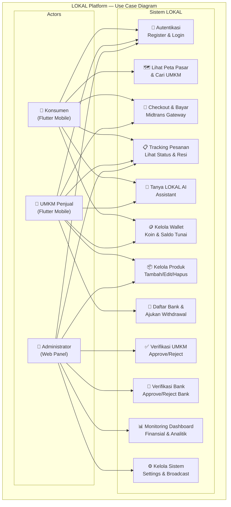
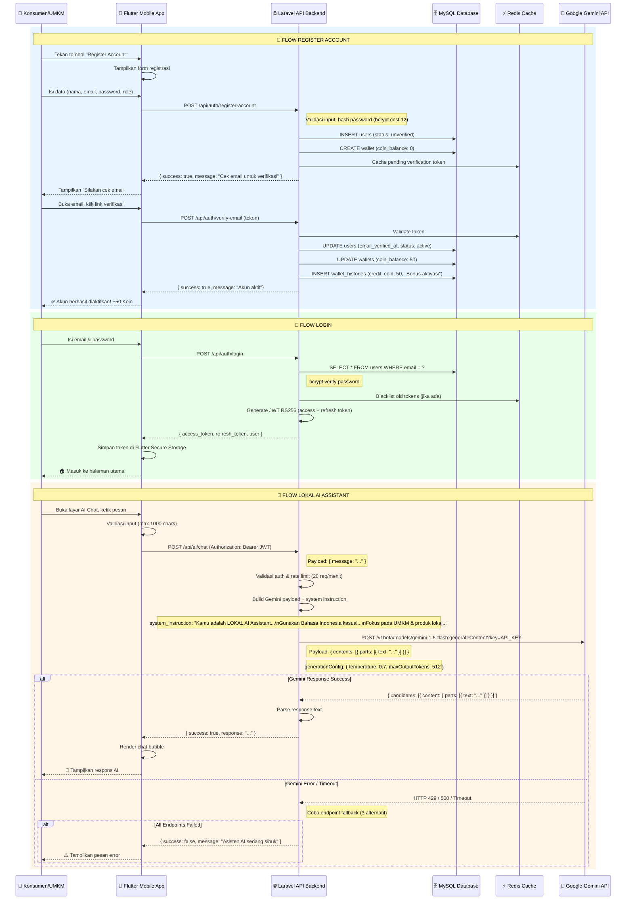
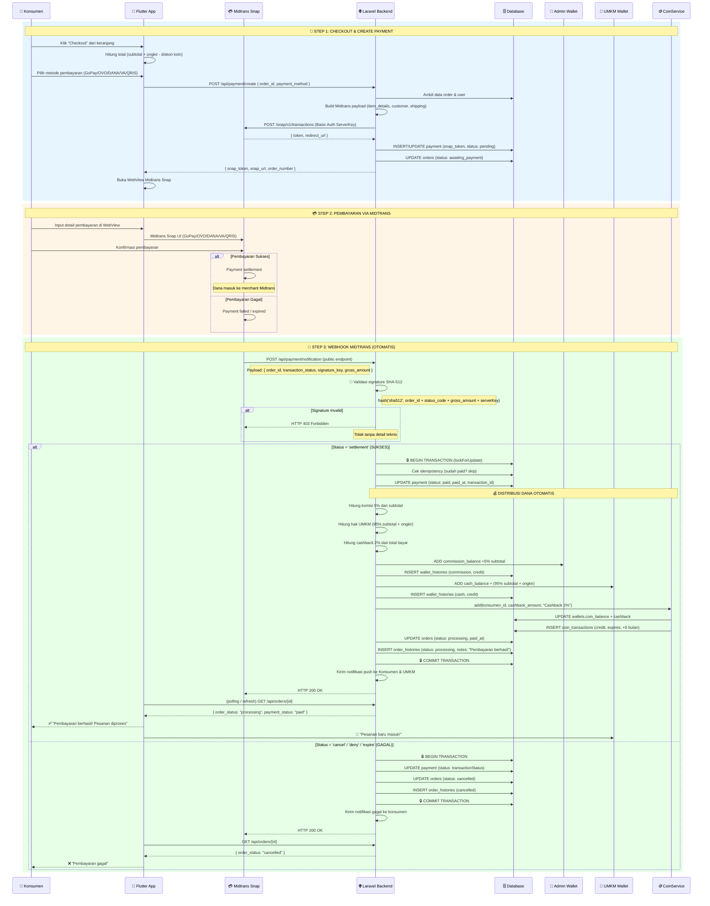
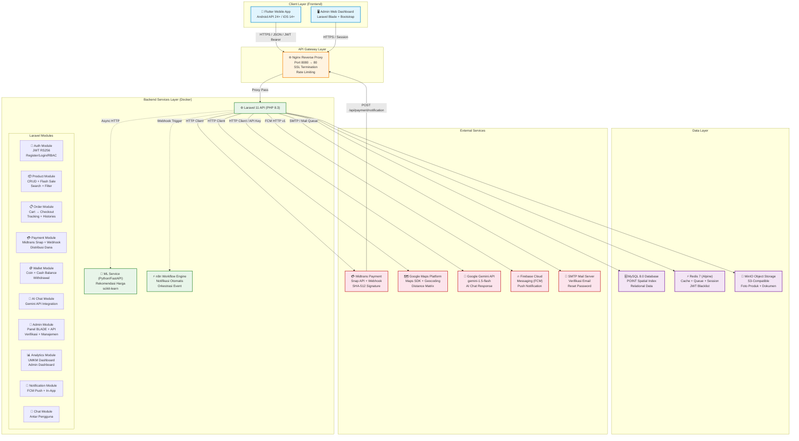

# Dokumentasi Teknis Platform LOKAL v1.5.0

## Diagram Arsitektur & Desain Sistem

**Platform Digital Berbasis Mobile untuk Optimalisasi Sirkulasi Ekonomi Lokal**

| **Dokumen** | **Detail** |
|------------|------------|
| Versi | 1.5.0 — Juli 2026 |
| Aplikasi | LOKAL (EkonomiLokal) |
| Teknologi | Flutter 3.x + Laravel 11 + MySQL 8.0 + Docker |
| Tim Pengembang | Tim Pengembang Platform LOKAL — UKRI |

---

## Daftar Isi

1. [Use Case Diagram & Skenario](#1-use-case-diagram--skenario)
2. [Entity Relationship Diagram (ERD)](#2-entity-relationship-diagram-erd)
3. [Class Diagram (Domain Business Structure)](#3-class-diagram-domain-business-structure)
4. [Sequence Diagram](#4-sequence-diagram)
   - [4a. Autentikasi & Chat AI](#4a-sequence-diagram-autentikasi--chat-ai)
   - [4b. Transaksi, Webhook Midtrans & Distribusi Dana](#4b-sequence-diagram-transaksi-webhook-midtrans--distribusi-dana)
5. [Component Diagram](#5-component-diagram)
6. [Deployment Diagram (Topologi Docker)](#6-deployment-diagram-topologi-infrastruktur--container-docker)

---

## 1. Use Case Diagram & Skenario

Diagram berikut menggambarkan interaksi **3 aktor utama** (Konsumen, UMKM, Admin) dengan sistem LOKAL beserta use case yang tersedia untuk masing-masing peran.



### Skenario Use Case Utama

| **Kode** | **Use Case** | **Aktor** | **Deskripsi Singkat** | **Prioritas** |
|----------|-------------|-----------|----------------------|:-------------:|
| UC-01 | Autentikasi | Konsumen, UMKM, Admin | Register Account (backend-driven), login Email+Password, JWT RS256, reset password, verifikasi email | **Tinggi** |
| UC-02 | Lihat Peta Pasar | Konsumen | Peta interaktif Google Maps, filter radius 0.5–10 km, marker UMKM, info window | **Tinggi** |
| UC-03 | Kelola Produk | UMKM, Admin | CRUD produk, upload foto (max 5), atur harga & stok, approve produk | **Tinggi** |
| UC-04 | Checkout & Bayar | Konsumen, UMKM | Keranjang multi-UMKM, checkout Midtrans (GoPay/OVO/DANA/VA/QRIS), konfirmasi otomatis via webhook | **Tinggi** |
| UC-05 | Tracking Pesanan | Konsumen, UMKM, Admin | Timeline status real-time, input nomor resi (UMKM), view tracking (Konsumen) | **Tinggi** |
| UC-06 | Tanya LOKAL AI | Konsumen, UMKM | Chatbot Gemini API, Bahasa Indonesia kasual, bantuan produk & bisnis | **Sedang** |
| UC-07 | Kelola Wallet | Konsumen, UMKM | Lihat saldo koin & tunai, redeem koin (diskon max 20%), riwayat transaksi | **Sedang** |
| UC-08 | Daftar Bank & Withdrawal | UMKM | Daftar rekening bank (pending), verifikasi Admin (approved/rejected), tarik dana (min Rp 50.000) | **Tinggi** |
| UC-09 | Verifikasi UMKM | Admin | Approve/reject pendaftaran UMKM setelah cek NIB/SIUP | **Tinggi** |
| UC-10 | Verifikasi Bank | Admin | Approve/reject rekening bank UMKM sebelum withdrawal | **Tinggi** |
| UC-11 | Dashboard Finansial | Admin | Grafik pendapatan platform, total user/UMKM/order, komisi, analitik | **Tinggi** |
| UC-12 | Kelola Sistem | Admin | Pengaturan global (komisi 5%, cashback 2%, diskon koin 20%), broadcast notifikasi | **Sedang** |

---

## 2. Entity Relationship Diagram (ERD)

Diagram berikut menggambarkan hubungan antar tabel database inti platform LOKAL.

```mermaid
erDiagram
    users ||--o{ umkms : "memiliki"
    users ||--o{ orders : "memesan"
    users ||--o{ wallets : "memiliki"
    users ||--o{ order_histories : "mencatat"
    users ||--o{ coin_transactions : "transaksi koin"
    users ||--o{ wallet_histories : "mutasi dompet"
    users ||--o{ withdrawals : "penarikan dana"
    users ||--o{ settings : "dikelola oleh"

    umkms ||--o{ products : "menjual"
    umkms ||--o{ orders : "menerima pesanan"
    umkms ||--o{ wallets : "dompet UMKM"
    umkms ||--o{ withdrawals : "pengajuan tarik dana"

    products ||--o{ orders : "termasuk dalam"

    orders ||--o{ order_histories : "riwayat status"
    orders ||--o{ payments : "pembayaran"

    wallets ||--o{ wallet_histories : "mutasi"

    users {
        int id PK
        string name
        string email UK
        string password "bcrypt cost 12"
        string phone
        enum role "konsumen | umkm | admin"
        string status "active | inactive | pending_verification"
        timestamp email_verified_at
        timestamp created_at
        timestamp updated_at
    }

    umkms {
        int id PK
        int user_id FK "unique"
        string store_name
        text description
        string address
        string city
        point coordinates "POINT(lat lng) spatial"
        string category
        string logo_url
        string nib_document "NIB/SIUP"
        enum status_verification "pending | approved | rejected"
        string bank_name
        string bank_account_number
        string bank_account_holder
        enum status_bank_verification "pending | approved | rejected"
        timestamp bank_verified_at
        text rejection_notes
        timestamp created_at
        timestamp updated_at
    }

    products {
        int id PK
        int umkm_id FK
        string name
        int price
        int stock
        int weight_gram
        text description
        string image_url
        json images "max 5 photos"
        string category
        enum status "active | inactive | pending"
        float rating_avg
        int sale_count
        timestamp created_at
        timestamp updated_at
    }

    orders {
        int id PK
        int user_id FK "konsumen"
        int umkm_id FK "penjual"
        string order_number UK "LOKAL-XXXX"
        int subtotal
        int shipping_fee
        int coin_discount
        int total "final_amount = subtotal + shipping - coin_discount"
        int admin_commission_amount "5% of subtotal"
        int umkm_revenue_amount "95% + shipping"
        enum payment_status "pending | paid | failed"
        enum order_status "pending | awaiting_payment | processing | shipped | completed | cancelled"
        string tracking_number "nomor resi"
        int address_id FK
        timestamp paid_at
        timestamp created_at
        timestamp updated_at
    }

    order_histories {
        int id PK
        int order_id FK
        int user_id FK "who changed it"
        string status
        string description
        timestamp created_at
    }

    payments {
        int id PK
        int order_id FK UK
        string snap_token
        string snap_url
        string transaction_id "from Midtrans"
        string payment_method "bca | mandiri | gopay | ovo | dana | qris"
        string status "pending | paid | challenge | cancel | deny | expire"
        int amount
        json raw_response "full Midtrans payload"
        timestamp paid_at
        timestamp expired_at
        timestamp created_at
        timestamp updated_at
    }

    wallets {
        int id PK
        int user_id FK UK
        int umkm_id FK "nullable"
        int coin_balance "default 50 saat aktivasi"
        int cash_balance "saldo tunai UMKM"
        int commission_balance "komisi platform admin"
        timestamp created_at
        timestamp updated_at
    }

    wallet_histories {
        int id PK
        int wallet_id FK
        enum type "credit | debit"
        enum balance_type "coin | cash | commission"
        int amount
        int balance_before
        int balance_after
        string description
        string reference_type "order | withdrawal | refund | cashback | commission"
        int reference_id "nullable"
        timestamp created_at
    }

    coin_transactions {
        int id PK
        int user_id FK
        enum type "credit | debit"
        int amount
        int balance_after
        string description
        date expires_at "6 months"
        boolean is_expired
        timestamp created_at
    }

    withdrawals {
        int id PK
        int umkm_id FK
        int user_id FK
        int amount
        string bank_name
        string bank_account_number
        string bank_account_holder
        enum status "pending | processed | rejected"
        text admin_notes
        timestamp processed_at
        timestamp created_at
        timestamp updated_at
    }

    settings {
        int id PK
        string key UK "commission_percent | cashback_percent | max_coin_discount_percent"
        string value
        string group "financial | general | notification"
        string label
        timestamp created_at
        timestamp updated_at
    }
```

### Keterangan Hubungan

| **Entitas #1** | **Relasi** | **Entitas #2** | **Makna Bisnis** |
|---------------|:----------:|---------------|-------------------|
| `users` | 1 ⟶ N | `umkms` | Satu user bisa memiliki satu toko UMKM (jika role=umkm) |
| `users` | 1 ⟶ N | `orders` | Konsumen dapat memesan banyak order |
| `users` | 1 ⟶ 1 | `wallets` | Setiap user memiliki satu dompet (coin + cash) |
| `umkms` | 1 ⟶ N | `products` | UMKM memiliki banyak produk |
| `umkms` | 1 ⟶ N | `orders` | UMKM menerima banyak pesanan masuk |
| `umkms` | 1 ⟶ N | `withdrawals` | UMKM dapat mengajukan banyak penarikan dana |
| `orders` | 1 ⟶ N | `order_histories` | Satu order memiliki banyak riwayat status |
| `orders` | 1 ⟶ 1 | `payments` | Satu order memiliki satu record pembayaran |
| `wallets` | 1 ⟶ N | `wallet_histories` | Satu dompet memiliki banyak mutasi |
| `settings` | — | — | Tabel konfigurasi global (komisi 5%, cashback 2%, diskon koin 20%) |

---

## 3. Class Diagram (Domain Business Structure)

Diagram class berikut merepresentasikan struktur objek bisnis inti, hubungan antar entitas (1-to-1, 1-to-many), atribut utama, dan method/fungsi kunci sesuai implementasi kode asli.

```mermaid
classDiagram
    class User {
        +int id
        +string name
        +string email
        +string password
        +string phone
        +string role
        +string status
        +timestamp email_verified_at
        +timestamp created_at
        +timestamp updated_at
        +register() bool
        +login() string  "returns JWT token"
        +verifyEmail() bool
        +resetPassword() bool
    }

    class Umkm {
        +int id
        +int user_id
        +string store_name
        +text description
        +string address
        +string city
        +point coordinates
        +string category
        +string logo_url
        +string nib_document
        +string status_verification
        +string bank_name
        +string bank_account_number
        +string bank_account_holder
        +string status_bank_verification
        +timestamp bank_verified_at
        +text rejection_notes
        +getProducts() Collection~Product~
        +getOrders() Collection~Order~
        +getAnalytics() array
    }

    class Product {
        +int id
        +int umkm_id
        +string name
        +int price
        +int stock
        +int weight_gram
        +text description
        +string image_url
        +json images
        +string category
        +string status
        +float rating_avg
        +int sale_count
        +timestamp created_at
        +timestamp updated_at
        +updateStock(int qty) void
        +isAvailable() bool
    }

    class Order {
        +int id
        +int user_id
        +int umkm_id
        +string order_number
        +int subtotal
        +int shipping_fee
        +int coin_discount
        +int total
        +int admin_commission_amount
        +int umkm_revenue_amount
        +string payment_status
        +string order_status
        +string tracking_number
        +int address_id
        +timestamp paid_at
        +timestamp created_at
        +timestamp updated_at
        +cancel() void
        +confirmReceived() void
        +getTrackingHistory() Collection~OrderHistory~
    }

    class OrderHistory {
        +int id
        +int order_id
        +int user_id
        +string status
        +string description
        +timestamp created_at
    }

    class Payment {
        +int id
        +int order_id
        +string snap_token
        +string snap_url
        +string transaction_id
        +string payment_method
        +string status
        +int amount
        +json raw_response
        +timestamp paid_at
        +timestamp expired_at
        +timestamp created_at
        +timestamp updated_at
    }

    class Wallet {
        +int id
        +int user_id
        +int umkm_id
        +int coin_balance
        +int cash_balance
        +int commission_balance
        +timestamp created_at
        +timestamp updated_at
        +recordHistory(type, balanceType, amount, description) WalletHistory
        +getBalance() array
    }

    class WalletHistory {
        +int id
        +int wallet_id
        +string type
        +string balance_type
        +int amount
        +int balance_before
        +int balance_after
        +string description
        +string reference_type
        +int reference_id
        +timestamp created_at
    }

    class CoinTransaction {
        +int id
        +int user_id
        +string type
        +int amount
        +int balance_after
        +string description
        +date expires_at
        +boolean is_expired
        +timestamp created_at
    }

    class Withdrawal {
        +int id
        +int umkm_id
        +int user_id
        +int amount
        +string bank_name
        +string bank_account_number
        +string bank_account_holder
        +string status
        +text admin_notes
        +timestamp processed_at
        +timestamp created_at
        +timestamp updated_at
    }

    class Setting {
        +int id
        +string key
        +string value
        +string group
        +string label
        +timestamp created_at
        +timestamp updated_at
        +getValue(key, default) mixed
        +commissionPercent() int
        +cashbackPercent() int
        +maxCoinDiscountPercent() int
        +clearCache() void
    }

    %% ── Controller Classes ──
    class AuthController {
        +register(Request) JsonResponse
        +login(Request) JsonResponse
        +logout(Request) JsonResponse
        +me() JsonResponse
        +refresh(Request) JsonResponse
        +forgotPassword(Request) JsonResponse
        +resetPassword(Request) JsonResponse
        +verifyEmail(Request) JsonResponse
    }

    class PaymentController {
        -NotificationService notifService
        -OrderController orderController
        +create(Request) JsonResponse
        +status(orderId) JsonResponse
        +notification(Request) Response  "Midtrans Webhook"
        +paymentFinish(Request) HtmlResponse
        +getTracking(id) JsonResponse
    }

    class OrderController {
        +index(Request) JsonResponse
        +store(Request) JsonResponse
        +show(id) JsonResponse
        +cancel(id) JsonResponse
        +confirmReceived(id) JsonResponse
        +sellerOrders(Request) JsonResponse
        +updateStatus(Request, id) JsonResponse  "UMKM update status + tracking_number"
        +processPaymentWebhook(Request) JsonResponse
        +distributePaymentFunds(Order) void
    }

    class AiChatController {
        +chat(Request) JsonResponse
    }

    class WalletController {
        +index(Request) JsonResponse
        +transactions(Request) JsonResponse
        +redeem(Request) JsonResponse
        +withdraw(Request) JsonResponse
    }

    class AdminController {
        +dashboard() JsonResponse
        +users() JsonResponse
        +toggleUserStatus(Request, id) JsonResponse
        +umkmList() JsonResponse
        +verifyUmkm(Request, id) JsonResponse
        +orders() JsonResponse
        +transactions() JsonResponse
        +approveProduct(Request, id) JsonResponse
        +deleteProduct(id) JsonResponse
    }

    %% ── Service Classes ──
    class CoinService {
        +static int COIN_TO_RUPIAH = 10
        +static maxDiscountPercent() int
        +add(userId, amount, description, expiresInDays) void
        +deduct(userId, rupiahAmount, description) void
        +calculateDiscount(coinBalance, subtotal) int
        +removeExpired() void
    }

    class NotificationService {
        +sendToUser(userId, data) void
        +sendToUmkm(umkmId, data) void
        +broadcast(data) void
        +registerDevice(Request) void
    }

    %% ── Relationships ──
    User "1" --> "0..*" Umkm : has
    User "1" --> "0..*" Order : places
    User "1" --> "1" Wallet : has
    User "1" --> "0..*" CoinTransaction : transactions
    User "1" --> "0..*" Withdrawal : requests

    Umkm "1" --> "0..*" Product : sells
    Umkm "1" --> "0..*" Order : receives
    Umkm "1" --> "0..*" Withdrawal : withdraws
    Umkm "1" --> "1" Wallet : hasStoreWallet

    Order "1" --> "0..*" OrderHistory : hasHistory
    Order "1" --> "1" Payment : hasPayment

    Wallet "1" --> "0..*" WalletHistory : hasHistories

    PaymentController --> OrderController : delegates distributePaymentFunds()
    PaymentController --> NotificationService : sends notifications
    OrderController --> CoinService : processes coin rewards
    OrderController --> NotificationService : sends order notifications

    %% ── Method Signatures ──
    note for OrderController "distributePaymentFunds():\n1. Hitung komisi 5% → admin_wallet.commission\n2. Alokasi 95% + ongkir → umkm_wallet.cash\n3. Cashback 2% coin → konsumen wallet\n4. Catat di wallet_histories\n5. Insert order_history\n6. Kirim notifikasi push"

    note for PaymentController "notification() - Webhook Midtrans:\n1. Validasi signature SHA-512\n2. Jika settlement: panggil distributePaymentFunds()\n3. Jika cancel/deny/expire: batalkan order\n4. Idempotency check\n5. DB transaction atomicity"

    note for AiChatController "chat():\n1. Validasi input (max 1000 chars)\n2. Ambil GEMINI_API_KEY dari config\n3. Kirim ke Gemini API (3 endpoint fallback)\n4. Parse response dari candidates[0]\n5. Return ke Flutter"

    note for CoinService "1 coin = Rp 10\nMax diskon = 20% subtotal\nCashback 2% otomatis saat settlement\nKoin expired 6 bulan"
```



### Relasi Domain Business

| **Class** | **Relasi** | **Target** | **Tipe** | **Deskripsi Bisnis** |
|-----------|:---------:|------------|:--------:|----------------------|
| `User` | ⟶ | `Umkm` | 1-to-1 | Satu user pemilik toko = satu UMKM (jika role=umkm) |
| `User` | ⟶ | `Order` | 1-to-many | Konsumen dapat memiliki banyak pesanan |
| `User` | ⟶ | `Wallet` | 1-to-1 | Setiap user memiliki 1 dompet |
| `User` | ⟶ | `CoinTransaction` | 1-to-many | Riwayat transaksi koin per user |
| `User` | ⟶ | `Withdrawal` | 1-to-many | Riwayat penarikan dana (UMKM) |
| `Umkm` | ⟶ | `Product` | 1-to-many | UMKM menjual banyak produk |
| `Umkm` | ⟶ | `Order` | 1-to-many | UMKM menerima banyak pesanan |
| `Order` | ⟶ | `OrderHistory` | 1-to-many | Satu order memiliki banyak riwayat status |
| `Order` | ⟶ | `Payment` | 1-to-1 | Satu order memiliki satu record pembayaran |
| `Wallet` | ⟶ | `WalletHistory` | 1-to-many | Satu dompet memiliki banyak mutasi |
| `PaymentController` | ⟶ | `OrderController` | Delegasi | Memanggil `distributePaymentFunds()` |
| `OrderController` | ⟶ | `CoinService` | Dependency | Untuk proses cashback & refund koin |
| `OrderController` | ⟶ | `NotificationService` | Dependency | Mengirim notifikasi push |

### Fungsi Kunci (Key Methods)

| **Method** | **Class** | **Deskripsi** |
|-----------|-----------|---------------|
| `distributePaymentFunds()` | OrderController | Distribusi dana setelah settlement: potong komisi 5%, alokasi 95%+ongkir ke UMKM, cashback 2% koin ke konsumen |
| `notification()` | PaymentController | Webhook Midtrans: validasi SHA-512, update status, distribusi dana, idempotency |
| `chat()` | AiChatController | Kirim prompt ke Gemini API, multi-endpoint fallback, parse respons |
| `add()` / `deduct()` | CoinService | Tambah/kurang koin dengan atomic DB transaction |
| `calculateDiscount()` | CoinService | Hitung maksimal diskon koin (min dari 20% subtotal atau saldo koin × 10) |
| `cancel()` | OrderController | Batalkan order: refund koin, restore stok, catat history |
| `recordHistory()` | Wallet | Catat mutasi wallet dengan balance tracking |
| `verifyUmkm()` | AdminController | Verifikasi UMKM oleh Admin (approve/reject) |

---

## 4. Sequence Diagram

### 4a. Sequence Diagram: Autentikasi & Chat AI

Diagram berikut menggambarkan alur interaksi antara **Konsumen/UMKM** → **Flutter App** → **API Laravel** → **Google Gemini API** untuk proses autentikasi (Register & Login) dan percakapan dengan LOKAL AI Assistant.



### 4b. Sequence Diagram: Transaksi, Webhook Midtrans & Distribusi Dana

Diagram berikut menggambarkan alur **Checkout** → **Pembayaran Midtrans** → **Webhook Notification** → **Distribusi Dana Otomatis** (Komisi 5%, Saldo UMKM 95%, Cashback 2%).



### Detail Distribusi Dana (Settlement)

Berikut rincian perhitungan distribusi dana saat webhook settlement:

```
Order:
  subtotal        = Rp 100.000
  shipping_fee    = Rp 15.000
  coin_discount   = Rp 5.000 (digunakan diskon koin)
  total           = Rp 110.000 (100.000 + 15.000 - 5.000)

Distribusi:
  ┌─ Komisi Platform (5% × subtotal)
  │    5% × 100.000 = Rp 5.000
  │    → admin_wallet.commission_balance += 5.000
  │
  ├─ Hak UMKM (95% × subtotal + ongkir)
  │    95% × 100.000 = Rp 95.000
  │    + ongkir Rp 15.000
  │    → umkm_wallet.cash_balance += Rp 110.000
  │
  └─ Cashback Koin (2% × total bayar)
       2% × 110.000 = Rp 2.200
       1 koin = Rp 10
       → 220 koin ke konsumen.wallet.coin_balance
       → expires dalam 6 bulan
```

---

## 5. Component Diagram

Diagram berikut menggambarkan pemisahan komponen sistem LOKAL secara arsitektural, termasuk alur komunikasi antar komponen.



### Deskripsi Komponen

| **Komponen** | **Teknologi** | **Fungsi Utama** |
|-------------|--------------|------------------|
| **Flutter Mobile App** | Flutter 3.x + Provider + Riverpod | Aplikasi mobile konsumen & UMKM (Android/iOS) |
| **Admin Web Dashboard** | Laravel Blade + Bootstrap | Panel admin berbasis web untuk manajemen & verifikasi |
| **Nginx** | Nginx Alpine | Reverse proxy, SSL termination, rate limiting, serve static |
| **Laravel API** | PHP 8.3 / Laravel 11 | REST API utama: auth, produk, order, payment, wallet, AI chat, admin |
| **Auth Module** | tymon/jwt-auth (RS256) | Registrasi, login, RBAC (Konsumen/UMKM/Admin) |
| **Product Module** | Laravel Eloquent | CRUD produk, flash sale, search, filter, kategorisasi |
| **Order Module** | Laravel Eloquent | Keranjang, checkout, tracking, order histories |
| **Payment Module** | Midtrans Snap API + Webhook | Pembayaran digital, webhook SHA-512, distribusi dana otomatis |
| **Wallet Module** | Laravel Service | Manajemen koin & saldo tunai, withdrawal, coin transaction |
| **AI Chat Module** | Google Gemini API | Chatbot AI untuk membantu konsumen & UMKM |
| **Admin Module** | Laravel Controller | Verifikasi UMKM & bank, dashboard finansial, pengaturan sistem |
| **ML Service** | Python FastAPI + scikit-learn | Rekomendasi harga produk UMKM secara asinkron |
| **n8n** | n8n Workflow Engine | Otomatisasi notifikasi & workflow event-driven |
| **MySQL** | MySQL 8.0 | Database utama dengan spatial index POINT |
| **Redis** | Redis 7 Alpine | Cache query, queue job, session, JWT blacklist |
| **MinIO** | MinIO S3-compatible | Object storage untuk foto produk & dokumen legalitas |
| **Midtrans** | Midtrans Snap | Payment gateway (GoPay/OVO/DANA/VA/QRIS) + webhook |
| **Google Maps** | Google Maps Platform | Peta interaktif, geocoding, distance matrix |
| **Google Gemini** | Gemini 1.5 Flash | AI generatif untuk LOKAL AI Assistant |
| **FCM** | Firebase Cloud Messaging | Push notification ke perangkat mobile |
| **SMTP** | Mail Server | Email verifikasi, reset password, notifikasi |

---

## 6. Deployment Diagram (Topologi Infrastruktur & Container Docker)

Diagram berikut menggambarkan arsitektur server production berbasis Docker yang mencakup **Client Devices**, **Nginx Reverse Proxy**, **Laravel App Container**, **MySQL Database**, **Redis**, **MinIO**, serta komponen pendukung opsional.

```mermaid
graph TB
    subgraph "Internet"
        DNS["🌐 DNS: api.lokal.id<br/>HTTPS (TLS 1.2+)"]
    end

    subgraph "Client Devices"
        MOBILE["📱 Mobile Devices<br/>Android / iOS<br/>Flutter App"]
        BROWSER["💻 Admin Browser<br/>Chrome / Firefox<br/>Web Dashboard"]
    end

    subgraph "Docker Host (VPS / Server)"
        direction TB
        
        subgraph "Network: ekonomi_lokal_network (bridge)"
            
            subgraph "Gateway Layer"
                NGINX["🌐 Nginx Container<br/>ekonomi_lokal_nginx<br/>Port: 8080 → 80<br/>SSL Termination<br/>Rate Limiting<br/>Static Files"]
            end

            subgraph "Application Layer"
                LARAVEL_APP["⚙️ Laravel App Container<br/>ekonomi_lokal_app<br/>PHP-FPM 8.3<br/>Laravel 11 API<br/>Port: 9000 (internal)"]
            end

            subgraph "Data Layer"
                MYSQL["🗄️ MySQL 8.0 Container<br/>ekonomi_lokal_mysql<br/>Port: 3306 (internal)<br/>Volume: mysql_data<br/>Database: ekonomi_lokal"]
                REDIS["⚡ Redis 7 Container<br/>ekonomi_lokal_redis<br/>Port: 6379 (internal)<br/>Volume: redis_data<br/>Cache + Queue + Session"]
                MINIO["📁 MinIO Container<br/>ekonomi_lokal_minio<br/>Port: 9000 (API)<br/>Port: 9001 (Console)<br/>Volume: minio_data<br/>Object Storage S3"]
            end

            subgraph "Optional Services"
                ML_SERVICE["🧠 ML Service Container<br/>(Python/FastAPI)<br/>Port: 8001 (internal)<br/>Price Recommendation"]
                N8N["⚡ n8n Container<br/>Workflow Automation<br/>Port: 5678<br/>Notification Pipeline"]
            end
        end
    end

    subgraph "External Services"
        MIDTRANS_EXT["💳 Midtrans<br/>Payment Gateway<br/>Snap API + Webhook"]
        GMAPS_EXT["🗺️ Google Maps<br/>Maps SDK + API"]
        GEMINI_EXT["🤖 Google Gemini<br/>AI API"]
        FCM_EXT["🔥 Firebase<br/>Cloud Messaging"]
        SMTP_EXT["📧 SMTP Server<br/>Mailgun/SendGrid"]
    end

    %% ── Network Connections ──
    MOBILE -->|"HTTPS /api/*"| NGINX
    BROWSER -->|"HTTPS /admin/*"| NGINX

    DNS -->|"TLS Termination"| NGINX

    NGINX -->|"FastCGI<br/>unix socket"| LARAVEL_APP

    LARAVEL_APP -->|"TCP 3306"| MYSQL
    LARAVEL_APP -->|"TCP 6379"| REDIS
    LARAVEL_APP -->|"TCP 9000"| MINIO

    LARAVEL_APP -.->|"Async HTTP"| ML_SERVICE
    LARAVEL_APP -.->|"Webhook"| N8N

    %% ── External Connections ──
    LARAVEL_APP -->|"HTTPS / REST API"| MIDTRANS_EXT
    LARAVEL_APP -->|"HTTPS / REST API"| GMAPS_EXT
    LARAVEL_APP -->|"HTTPS / API Key"| GEMINI_EXT
    LARAVEL_APP -->|"FCM HTTP v1"| FCM_EXT
    LARAVEL_APP -->|"SMTP"| SMTP_EXT

    MIDTRANS_EXT -->|"POST Webhook<br/>/api/payment/notification"| NGINX

    %% ── Volume Mounts ──
    MYSQL --- VOL_MYSQL["📦 Volume: mysql_data<br/>/var/lib/mysql"]
    REDIS --- VOL_REDIS["📦 Volume: redis_data<br/>/data"]
    MINIO --- VOL_MINIO["📦 Volume: minio_data<br/>/data"]

    %% ── Styles ──
    classDef internet fill:#e8eaf6,stroke:#283593,stroke-width:2px
    classDef client fill:#e1f5fe,stroke:#0288d1,stroke-width:2px
    classDef network fill:#fff3e0,stroke:#f57c00,stroke-width:2px
    classDef gateway fill:#fff8e1,stroke:#f9a825,stroke-width:2px
    classDef app fill:#e8f5e9,stroke:#388e3c,stroke-width:2px
    classDef data fill:#f3e5f5,stroke:#7b1fa2,stroke-width:2px
    classDef optional fill:#fbe9e7,stroke:#d84315,stroke-width:2px,stroke-dasharray: 5 5
    classDef external fill:#fce4ec,stroke:#c62828,stroke-width:2px
    classDef volume fill:#f1f8e9,stroke:#558b2f,stroke-width:1px,stroke-dasharray: 3 3

    class DNS internet
    class MOBILE,BROWSER client
    class NGINX gateway
    class LARAVEL_APP app
    class MYSQL,REDIS,MINIO data
    class ML_SERVICE,N8N optional
    class MIDTRANS_EXT,GMAPS_EXT,GEMINI_EXT,FCM_EXT,SMTP_EXT external
    class VOL_MYSQL,VOL_REDIS,VOL_MINIO volume
```



### Spesifikasi Container Docker

| **Container** | **Image** | **Port (Host:Container)** | **Volume** | **Environment Variables** |
|:------------:|:---------:|:-------------------------:|:----------:|:--------------------------|
| **Nginx** | `nginx:alpine` | `8080:80` | App code, `default.conf` | — |
| **Laravel App** | *Custom Dockerfile* (PHP 8.3) | — (internal 9000) | App code, storage | `APP_ENV`, `DB_*`, `REDIS_*`, `MIDTRANS_*`, `GEMINI_API_KEY`, `FCM_*`, `MINIO_*` |
| **MySQL** | `mysql:8.0` | — (internal 3306) | `mysql_data:/var/lib/mysql` | `MYSQL_ROOT_PASSWORD`, `MYSQL_DATABASE`, `MYSQL_USER`, `MYSQL_PASSWORD` |
| **Redis** | `redis:7-alpine` | — (internal 6379) | `redis_data:/data` | — |
| **MinIO** | `minio/minio:latest` | `9000:9000`, `9001:9001` | `minio_data:/data` | `MINIO_ROOT_USER`, `MINIO_ROOT_PASSWORD` |

### Docker Compose Reference

Dari file `docker-compose.yml` yang sudah ada:

```
services:
  app:      # Laravel PHP-FPM (build dari Dockerfile)
    container_name: ekonomi_lokal_app
    restart: unless-stopped
    volumes: [.:/var/www/html]
    networks: [ekonomi_lokal_network]

  nginx:    # Web Server
    container_name: ekonomi_lokal_nginx
    image: nginx:alpine
    ports: [8080:80]
    volumes: [., ./docker/nginx/default.conf]
    depends_on: [app]

  mysql:    # Database
    container_name: ekonomi_lokal_mysql
    image: mysql:8.0
    environment:
      MYSQL_ROOT_PASSWORD: secret
      MYSQL_DATABASE: ekonomi_lokal
      MYSQL_USER: ekonomi_user
      MYSQL_PASSWORD: secret
    volumes: [mysql_data:/var/lib/mysql]

  redis:    # Cache & Queue
    container_name: ekonomi_lokal_redis
    image: redis:7-alpine
    volumes: [redis_data:/data]

  minio:    # Object Storage
    container_name: ekonomi_lokal_minio
    image: minio/minio:latest
    ports: [9000:9000, 9001:9001]
    environment:
      MINIO_ROOT_USER: minioadmin
      MINIO_ROOT_PASSWORD: minioadmin
    volumes: [minio_data:/data]
    command: server /data --console-address ":9001"

networks:
  ekonomi_lokal_network:
    driver: bridge

volumes:
  mysql_data:
  redis_data:
  minio_data:
```

### Alur Deployment

```
Developer Push → GitHub Repository
       ↓
GitHub Actions (CI/CD Pipeline)
       ↓
Pull image dari Docker Hub / Build image
       ↓
Deploy ke VPS Server
       ↓
docker-compose pull && docker-compose up -d
       ↓
Migrate Database: php artisan migrate --seed
       ↓
✅ Production Live!
```

---

## Referensi

| **Dokumen** | **Lokasi** |
|------------|-----------|
| Software Requirements Specification (SRS) | `SRS/SRS_Ekonomi_Lokal.md` |
| README Utama | `README.md` |
| Backend API Routes | `backend/routes/api.php` |
| Web Admin Routes | `backend/routes/web.php` |
| Docker Compose | `backend/docker-compose.yml` |
| Frontend Screens | `frontend/lib/screens/` |

---

<p align="center">
  <i>© 2026 Tim Pengembang Platform LOKAL — UKRI</i><br>
  <i>Dokumentasi Teknis ini disusun berdasarkan implementasi kode asli dan SRS v1.5.0</i>
</p>